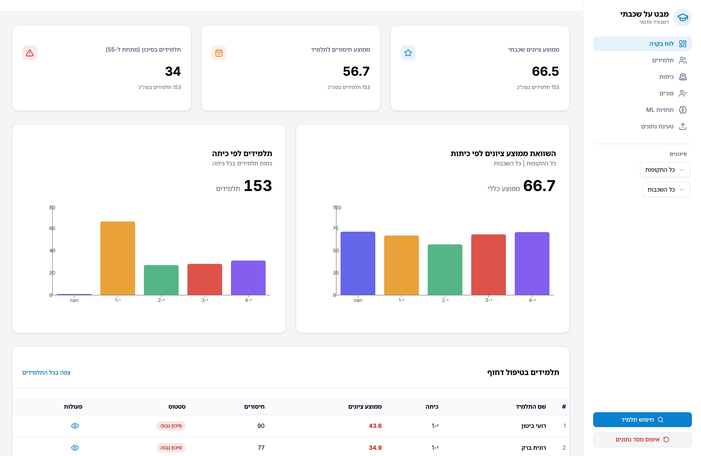

# Student Personalizer (Pedagogical Dashboard)



A comprehensive interactive BI system designed for educational staff to analyze academic achievements, behavior, and attendance at the school, class, and individual student levels.

## 🚀 Key Features

*   **Dashboard Overview**: High-level KPIs including grade-level performance, attendance trends, and at-risk student tracking.
*   **Class Analytics**: Interactive heatmaps to identify cross-subject challenges and performance tables.
*   **Student Profiles**: Deep-dive individual analysis using Radar charts for subject coverage, attendance history, and performance trends.
*   **Data Ingestion**: Seamless drag-and-drop import of Excel reports (grades, attendance, behavior).
*   **Smart Filtering**: Dynamic sidebar for filtering data by time range, class, subject, teacher, and student.
*   **Predictive Analytics**: ML-powered insights to identify students requiring intervention.

## 🛠 Tech Stack

### Backend
*   **Language**: Python 3.13+
*   **Framework**: FastAPI
*   **Database**: SQLite (via aiosqlite & SQLModel)
*   **Data Processing**: Pandas, NumPy, OpenPyXL
*   **Machine Learning**: Scikit-learn
*   **Visualization**: Matplotlib, Seaborn

### Frontend
*   **Framework**: React 19 + Vite
*   **Language**: TypeScript
*   **Styling**: Tailwind CSS 4
*   **Components**: Shadcn UI
*   **Charts**: Recharts
*   **State Management**: Zustand
*   **Routing**: TanStack Router

## 📦 Installation & Setup

### Prerequisites
*   Node.js (v18+ recommended)
*   Python 3.13+
*   [`uv`](https://github.com/astral-sh/uv) (Python package manager)

### 1. Backend Setup

Navigate to the server directory and set up the environment:

```bash
cd server

# Create virtual environment and install dependencies
uv sync
```

Create a `.env` file in the `server` directory (copy from `.env.example` if available) to configure your environment variables.

Run the development server:
```bash
uv run server
```
The API will be available at `http://localhost:3000` (Documentation at `/docs`).

### 2. Frontend Setup

Navigate to the client directory:

```bash
cd client

# Install dependencies
npm install
```

Run the development server:
```bash
npm run dev
```
The application will be accessible at `http://localhost:5173`.
